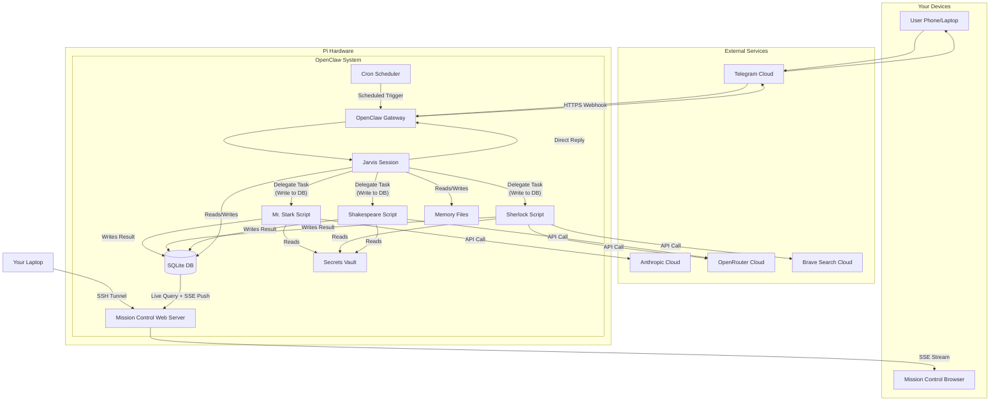

# OpenClaw Setup Guide: Appendix & Reference

## 📌 TL;DR
*   This appendix provides a detailed **agent catalog** and a **system architecture diagram** for the OpenClaw personal assistant system.
*   The catalog explains each agent's role, how to invoke them, where they run, their costs, and their limitations.
*   The diagram and explanation show how a user's message flows through Telegram, the Pi, and various cloud providers, ending up back on your phone and dashboard.
*   Use this document as a lookup reference when you need to understand how a specific agent works or trace the path of a task through your system.

## 🧠 Agent Catalog

This section details the four specialized agents that power your OpenClaw system. Each agent has a specific role, model, and invocation pattern.

### 🦾 Jarvis

**Role:** The primary orchestrator and conversational interface; your main point of contact.
**Model:** Claude Opus (via Anthropic)
**Where they run:** Long-running Claude session managed by the OpenClaw Gateway daemon.
**Key file:** `~/.openclaw/secrets/anthropic.env`
**Invocation:**
*   **Shell:** Automatically started by the Gateway daemon. No direct CLI invocation.
*   **Telegram:** Send any message to your private Telegram bot. Jarvis receives it via the Gateway.
**Typical tasks:**
*   Holding natural conversations and understanding context.
*   Delegating complex tasks to specialist agents (Mr. Stark, Sherlock, Shakespeare).
*   Managing and updating system memory files.
*   Writing and executing simple Python or shell scripts directly.
*   Summarizing information and providing strategic advice.
**Output location:** Conversational replies are sent to Telegram. Task delegation creates entries in the Mission Control database (`~/.openclaw/workspace/mission-control/prisma/mission-control.db`).
**Cost profile:** **Mid-tier.** As your main conversational agent, he handles most messages. Cost scales linearly with conversation length and complexity.
**Known limitations:**
*   Cannot directly execute long, complex code or perform deep web research.
*   Relies on delegation to specialists for those tasks, which adds a round-trip delay.
*   Context is limited to his current session and memory files; he does not have real-time access to the wider internet.
**Special behaviors:**
Jarvis maintains a persistent memory system to preserve context across conversations and days:
*   **Core Memory Files:** `AGENTS.md`, `SOUL.md`, `USER.md`, `IDENTITY.md`, `MEMORY.md`. These define system capabilities, principles, your preferences, and accumulated knowledge.
*   **Daily Logs:** `~/.openclaw/workspace/memory/YYYY-MM-DD.md`. A running transcript of each day's activity.
*   **Routing:** He decides when to handle a task himself or delegate by writing a task record to the SQLite database and invoking the specialist's wrapper script.
*   **Mission Control:** All his delegated tasks and their statuses are tracked live on the Mission Control web dashboard.

### 🔧 Mr. Stark

**Role:** The coding and systems automation specialist.
**Model:** Claude Sonnet (via Claude Code CLI)
**Where they run:** Invoked via the `~/.openclaw/workspace/scripts/stark.sh` wrapper script, which calls the Claude Code CLI binary.
**Key file:** `~/.openclaw/secrets/anthropic.env`
**Invocation:**
*   **Shell:** `~/.openclaw/workspace/scripts/stark.sh "Your coding task here"`
*   **Telegram:** `> Mr. Stark, write a script to...` (Jarvis formats this into the shell invocation).
**Typical tasks:**
*   Writing, debugging, and explaining complex code in multiple languages.
*   Analyzing system logs and proposing fixes.
*   Generating configuration files (Docker, Nginx, systemd).
*   Performing data analysis and visualization scripts.
*   Building automation scripts for file management or API interactions.
**Output location:** Primary output is printed to stdout and captured by Jarvis. Complex deliverables are saved to `/tmp/` or a specified directory.
**Cost profile:** **Mid-tier.** Similar cost-per-token to Jarvis, but used less frequently for focused, intensive tasks.
**Known limitations:**
*   Requires the Claude Code CLI binary to be installed and configured separately.
*   Operates in a stateless, one-off execution context; does not maintain conversation history between invocations.
*   Best for concrete implementation tasks, not open-ended exploration or strategy.

### 🔬 Sherlock

**Role:** The research and information-gathering specialist.
**Model:** Qwen3-235B (via OpenRouter)
**Where they run:** Python scripts `~/.openclaw/workspace/scripts/sherlock-research.py` and `sherlock-topic.py`.
**Key file:** `~/.openclaw/secrets/openrouter.env` and `~/.openclaw/secrets/brave.env`
**Invocation:**
*   **Shell:** `~/.openclaw/workspace/scripts/sherlock-research.py "Your research query here"`
*   **Telegram:** `> Sherlock, find the latest news about...` (Jarvis routes to the script).
**Typical tasks:**
*   Performing web searches via the Brave Search API.
*   Summarizing news articles, technical documentation, or competitive landscapes.
*   Answering factual, time-sensitive questions.
*   Compiling reports on specific topics from multiple sources.
**Output location:** Research results are written as markdown to `~/.openclaw/workspace/writing/research/` and a summary is stored in the Mission Control database.
**Cost profile:** **Low.** Uses a capable but cost-efficient model via OpenRouter. Additional minimal cost for Brave Search API calls.
**Known limitations:**
*   Search results depend on the quality and breadth of the Brave Search API.
*   Not designed for creative writing or coding tasks.
*   Can process existing information but cannot execute actions or interact with systems.

### 🪶 Shakespeare

**Role:** The writing, editing, and document structuring specialist.
**Model:** DeepSeek-V3.2 (via OpenRouter)
**Where they run:** Python script `~/.openclaw/workspace/scripts/shakespeare.py`.
**Key file:** `~/.openclaw/secrets/openrouter.env`
**Invocation:**
*   **Shell:** `~/.openclaw/workspace/scripts/shakespeare.py "Your writing task here"`
*   **Telegram:** `> Shakespeare, draft a blog post about...` (Jarvis routes to the script).
**Typical tasks:**
*   Drafting and polishing emails, blog posts, and documentation.
*   Restructuring and editing existing text for clarity and tone.
*   Generating outlines, summaries, and key takeaways.
*   Adhering to specific style guides and formatting requests.
**Output location:** Written deliverables are saved to `~/.openclaw/workspace/writing/drafts/` and referenced in the Mission Control database.
**Cost profile:** **Very Low.** Uses a highly cost-effective model optimized for writing tasks.
**Known limitations:**
*   Specialized for language manipulation; weak at coding, research, or system analysis.
*   Requires clear, well-defined writing prompts for best results.
*   Does not have inherent knowledge; works with the text and context you provide.

## 🏗️ System Architecture & Data Flow

The following diagram illustrates how components interact when you send a message to your OpenClaw assistant.

### 🔍 Architecture Walkthrough

**1. Where your messages go**
When you send a message to your private Telegram bot, Telegram's servers forward it via a secure webhook to the **OpenClaw Gateway** daemon running on your Pi. The Gateway decrypts the message (using keys stored in `~/.openclaw/openclaw.json`) and passes it to the active **Jarvis** session. From Telegram's perspective, they are sending data to your Pi's IP address. From Anthropic's perspective (Jarvis's provider), they are receiving an API call from your Pi. Your original message content is seen by Telegram and the AI provider, but no other personal data leaves your Pi.

**2. How delegation works**
If your request requires a specialist, Jarvis decides which agent to use. He creates a new task record in the shared **SQLite database**, then invokes the specialist's wrapper script (e.g., `stark.sh`). That script runs independently: it reads its own API keys from the **Secrets Vault** (`~/.openclaw/secrets/`), calls its assigned cloud provider (Anthropic, OpenRouter, Brave), performs its work, and writes its results back to the database and often to a file on disk. Jarvis monitors the database, picks up the completed result, and incorporates it into his final reply to you.

**3. Why Mission Control sees everything live**
The **Mission Control** web server (Next.js) and all agents read from and write to the same single **SQLite database** file. This is the system's source of truth for tasks, statuses, and results. When an agent updates a task record, the Mission Control server detects the change and instantly pushes an update via Server-Sent Events (SSE) to your connected browser dashboard. This creates the live, synchronized view of system activity.

**4. How cron jobs fit in**
The system includes its own **Cron Scheduler** (not the Unix `crontab`). Jobs are defined in `~/.openclaw/cron/<job-id>/`. At the scheduled time, the Gateway daemon wakes up, loads the job, and executes it in a fresh session. This cron session still has access to the same shared database and memory files, allowing scheduled jobs to log activity, create tasks, or update memory just like a user-triggered interaction.

**5. Trust boundaries**
Your Pi houses all sensitive components: the **Secrets Vault** with API keys, the **Memory Files** with your personal context, the **Database** with your task history, and the agent logic itself. The only data that leaves your Pi are:
*   Prompts and context sent to AI providers (Anthropic, OpenRouter).
*   Search queries sent to Brave.
*   Encrypted messages to and from Telegram.
No files, database contents, or raw memory logs are transmitted externally by design. The SSH tunnel for Mission Control ensures that dashboard traffic never leaves your local network.

## 💬 Try This

Use this appendix as a reference when you need to understand the inner workings of your system.

> **When to come back to this appendix:**
> *   You forget how to invoke a specialist directly from the shell.
> *   A task seems stuck, and you want to trace its path through the architecture diagram.
> *   You're planning a complex project and need to compare agent capabilities and costs.
> *   You need to check the exact location of a memory file or the database.
>
> **Example lookup prompt for Jarvis:**  
> `> Jarvis, remind me how Sherlock is invoked and what his limitations are — show me the appendix entry.`
