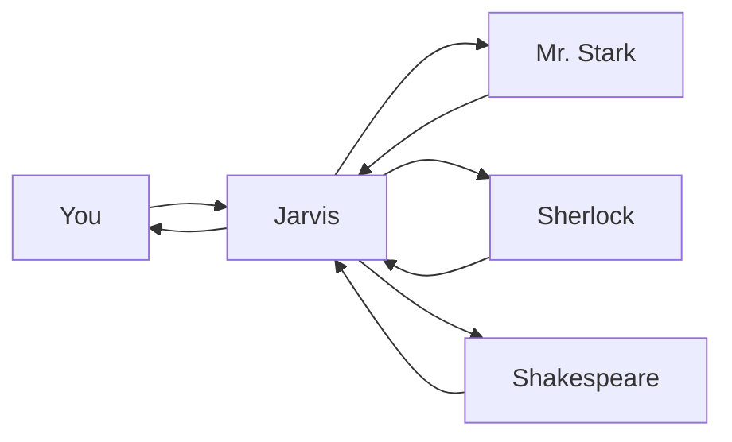

# Chapter 3: Install Your Specialist Team (Mr. Stark, Sherlock, Shakespeare)

## 📌 TL;DR
- You'll extend from 1 agent (Jarvis) to 4: Mr. Stark (Engineer), Sherlock (Researcher), Shakespeare (Writer).
- Every specialist follows the same 2-step install: save a key to `~/.openclaw/secrets/`, then prompt Jarvis to do the rest.
- Your API keys never touch Telegram. Your agent-install work never touches shell beyond the key file.
- ~$0-15/month for light personal use. Mix of Claude Sonnet (Claude Code CLI), Qwen3, DeepSeek.
- By the end: a 4-agent team coordinating through Jarvis in one Telegram chat.

## 👋 Meet the Team

You started with Jarvis, your generalist orchestrator. Now you'll add three specialists who excel at specific work.

| Agent | Role | Model (Provider) | Cost Profile |
|-------|------|------------------|--------------|
| **Jarvis** | Orchestrator & Generalist | Claude Opus (Anthropic) | Highest capability, highest per-token cost |
| **Mr. Stark** | Lead Engineer | Claude Sonnet via Claude Code CLI (Anthropic) | Solid capability, mid-tier cost |
| **Sherlock** | Research Specialist | Qwen3-235B via OpenRouter | Strong reasoning, low cost |
| **Shakespeare** | Writer | DeepSeek V3.2 via OpenRouter | Solid structured writing, very low cost |
| **Brave Search** | Search Backend | Free Tier API | ~2000 queries/month |

**Why different models?** Three reasons:
1. **Cost:** Specialized models for research and writing cost far less than Opus for routine tasks.
2. **Specialty:** Each model is tuned for its role — Sonnet for code, Qwen3 for reasoning, DeepSeek for structured writing.
3. **Provider diversity:** If one provider has an outage, your whole team doesn't go down.

## ⏱️ Time & Difficulty

- **Time:** 45-75 minutes (most is waiting on Jarvis's install runs).
- **Difficulty:** Beginner. Each agent is ~15 minutes, same rhythm across all three.

## 🎯 The Install Rhythm

Every specialist below uses the same **two-step rhythm**. You'll repeat it three times:

1. **Save the API key** to `~/.openclaw/secrets/<provider>.env` (quick shell work, keeps secrets off Telegram).
2. **Ask Jarvis** to install the agent (Jarvis does everything else — installs binaries, writes wrappers, downloads scripts, registers in memory, runs smoke tests).

Your only shell work per agent is the key file. Jarvis handles the rest.

---

## 👨‍💻 Agent 1 — Mr. Stark (Lead Engineer)

Mr. Stark handles software engineering, scripting, debugging, and system automation. He runs via the **Claude Code CLI**, giving you a code-focused assistant that can write, test, and execute scripts directly.

### Step 1 — Save the Anthropic Key

If you already created `~/.openclaw/secrets/anthropic.env` in Chapter 2 (for Jarvis), you can skip this step — Mr. Stark reuses the same key.

If you don't have it yet:

```bash
mkdir -p ~/.openclaw/secrets && chmod 700 ~/.openclaw/secrets
nano ~/.openclaw/secrets/anthropic.env
```

Inside nano, paste **exactly one line**:
```
ANTHROPIC_API_KEY=sk-ant-...
```

Save (Ctrl+O, Enter), exit (Ctrl+X), then lock down permissions:

```bash
chmod 600 ~/.openclaw/secrets/anthropic.env
```

### Step 2 — Prompt Jarvis

```
💬 Try this
> Jarvis, let's add Mr. Stark — our Lead Engineer. Here's the spec:
>
> • Role: Software engineering, scripting, debugging, system automation.
> • Runtime: Claude Code CLI (install globally via npm).
> • Model: Claude Sonnet via Claude Code (keep Opus off by default — Sonnet is plenty for most code work).
> • API key: reuse mine from ~/.openclaw/secrets/anthropic.env.
> • Wrapper: create ~/.openclaw/workspace/scripts/stark.sh that sources the env, supports a STARK_CWD override, and runs claude with bypassPermissions and print mode.
> • Register him in your memory at ~/.openclaw/workspace/memory/mr-stark.md.
> • Smoke test: have him write a one-liner Python script that prints today's date, save to /tmp/hello.py, run it, confirm the output.
```

**✅ What you should see**

1. Jarvis: "Got it — installing Mr. Stark. ETA ~5 min."
2. Telegram updates:
   • "Installing @anthropic-ai/claude-code globally..."
   • "Writing ~/.openclaw/workspace/scripts/stark.sh..."
   • "Made stark.sh executable."
   • "Saved agent profile to memory/mr-stark.md."
   • "Smoke test: asking Mr. Stark to write /tmp/hello.py..."
   • "Smoke test passed. Output matched today's date."
3. Jarvis: "✅ Mr. Stark is live. To use him, just ask me to delegate code work."

### 📜 The Wrapper Contract

Jarvis builds a wrapper script for Mr. Stark. You don't need to type this, but here's what he creates so you can verify:

```bash
#!/bin/bash
set -e
SECRETS_FILE="${HOME}/.openclaw/secrets/anthropic.env"
[ -f "$SECRETS_FILE" ] || { echo "Missing $SECRETS_FILE" >&2; exit 1; }
set -a; source "$SECRETS_FILE"; set +a
[ -n "$STARK_CWD" ] && cd "$STARK_CWD"
exec claude --permission-mode bypassPermissions --print "$1"
```

This wrapper:
- Sources your Anthropic key from the secrets file.
- Supports `STARK_CWD` to change working directory.
- Runs Claude Code with `bypassPermissions` (so it can execute code) and `print` mode.

### 🧪 Verify Mr. Stark Works

```
💬 Try this
> Jarvis, who's on the team now?
```

**✅ What you should see**
Jarvis lists himself + Mr. Stark with roles and models.

```
💬 Try this
> Jarvis, have Mr. Stark write a Python script that counts words in a text file. Save it to ~/scripts/wordcount.py.
```

**✅ What you should see**
1. Jarvis: "Handing off to Mr. Stark."
2. Mr. Stark works, writes the file, tests it, reports back via Jarvis.
3. Final: "✅ `~/scripts/wordcount.py` is ready. Usage: `python3 ~/scripts/wordcount.py FILE`."

**Note:** You'll register Mr. Stark with Mission Control when you build it in Chapter 4. For now, Jarvis knowing about him via `memory/mr-stark.md` is sufficient.

---

## 🔍 Agent 2 — Sherlock (Research Specialist)

Sherlock handles web research with synthesis. He's your go-to for daily news briefs and ad-hoc topic research, using Qwen3-235B for reasoning and Brave Search for data.

### Step 1 — Save OpenRouter + Brave Keys

First, get your keys:

1. **OpenRouter:** Browse to [openrouter.ai](https://openrouter.ai), sign up, add $5 credits, create a key starting with `sk-or-v1-`.
2. **Brave Search:** Go to [brave.com/search/api](https://brave.com/search/api), sign up for the Free plan (2000 queries/month), and create a **Subscription Token** (Brave's name for the API key). It starts with `BSA` followed by a string of letters and numbers.

Back on your Pi terminal:

```bash
nano ~/.openclaw/secrets/openrouter.env
```

Paste exactly one line:
```
OPENROUTER_API_KEY=sk-or-v1-...
```

Save, exit, then:

```bash
chmod 600 ~/.openclaw/secrets/openrouter.env

nano ~/.openclaw/secrets/brave.env
```

Paste exactly one line:
```
BRAVE_SEARCH_API_KEY=BSA_YourActualTokenHere
```

Save, exit, then:

```bash
chmod 600 ~/.openclaw/secrets/brave.env
```

### Step 2 — Prompt Jarvis

```
💬 Try this
> Jarvis, let's add Sherlock — our Research Specialist. Here's the spec:
>
> • Role: Web research with synthesis. Used for daily news briefs and ad-hoc topic research.
> • Model: Qwen3-235B via OpenRouter.
> • Search backend: Brave Search API.
> • Keys already saved: ~/.openclaw/secrets/openrouter.env and ~/.openclaw/secrets/brave.env.
> • Install the sherlock research + topic scripts to ~/.openclaw/workspace/scripts/.
> • Register him in memory/sherlock.md.
> • Save outputs to ~/.openclaw/workspace/writing/research/ and send a Telegram summary.
> • Smoke test: ask Sherlock "What are today's top 3 AI news stories?" and confirm a research doc lands.
```

**✅ What you should see**

1. Jarvis: "On it — handing to Mr. Stark for the install work."
2. Mr. Stark progress:
   • "Installing sherlock-research.py and sherlock-topic.py to ~/.openclaw/workspace/scripts/"
   • "Writing memory/sherlock.md"
   • "Running smoke test..."
   • "Test passed. Research saved to writing/research/YYYY-MM-DD-HHMM-ai-news.md"
3. Jarvis: "✅ Sherlock is live. Use him by asking me for research."

### 🧪 Try Sherlock

```
💬 Try this
> Jarvis, have Sherlock research the best cheap mechanical keyboards of 2026.
```

**✅ What you should see**
Within 60-120 seconds, a research doc in Telegram: bulleted summary with brands, price ranges, standout features, and links. Also saved to `writing/research/`.

---

## ✍️ Agent 3 — Shakespeare (Writer)

Shakespeare drafts BRDs, business cases, LinkedIn posts, Instagram captions, emails, skill definitions, and project docs. He uses DeepSeek V3.2 for structured, consistent writing.

### Step 1 — No New Key Needed

**Perk of the unified pattern:** Shakespeare reuses the **same OpenRouter key** you saved for Sherlock. No additional shell work required.

### Step 2 — Prompt Jarvis

```
💬 Try this
> Jarvis, let's add Shakespeare — our Writer. Here's the spec:
>
> • Role: Drafts BRDs, business cases, LinkedIn posts, Instagram captions, emails, skill definitions, and project docs.
> • Model: DeepSeek V3.2 via OpenRouter (reuse my OpenRouter key from Sherlock setup).
> • Install the shakespeare script to ~/.openclaw/workspace/scripts/.
> • Register him in memory/shakespeare.md.
> • Save outputs to ~/.openclaw/workspace/writing/<category>/ and send a Telegram delivery.
> • Smoke test: write a short LinkedIn post about shipping side projects.
```

**✅ What you should see**

1. Jarvis confirms and hands off.
2. Mr. Stark installs the script (reuses OpenRouter key), runs smoke test, delivers the draft.
3. Jarvis: "✅ Shakespeare is live. Use him for writing work."

### 🧪 Try Shakespeare

```
💬 Try this
> Jarvis, have Shakespeare write a short email declining a sales demo request politely.
```

**✅ What you should see**
Within ~60 seconds, a polished 5-7 sentence email in Telegram, with a link to the saved copy in `writing/emails/`.

---

## 🔄 How the Team Coordinates

All coordination flows through Jarvis in your single Telegram chat:



Here's how it works:

1. **You ask Jarvis** for any task — coding, research, writing.
2. **Jarvis routes** to the right specialist based on role and availability.
3. **Agents emit status events** as they work (`task.claimed`, `task.completed`, `doc.created`) — you'll see these flow live once Mission Control is up in Chapter 4.
4. **Jarvis delivers** the final output back to you in Telegram, with links to saved files.

## 💬 Multi-Agent Prompts to Try

Now that your team is complete, try these coordinated workflows:

**Example 1: Research + Write**
```
> Jarvis, have Sherlock research the latest developments in personal AI agents, then have Shakespeare draft a LinkedIn post summarizing the most exciting insight.
```

**Example 2: Build + Document**
```
> Jarvis, have Mr. Stark write a Python script that backs up my ~/Documents folder to a timestamped ZIP, then have Shakespeare write a one-page README explaining how to use it.
```

## 📝 Save These for Later

Your setup creates these key assets:

| Path | Purpose |
|------|---------|
| `~/.openclaw/secrets/` | All API keys (`anthropic.env`, `openrouter.env`, `brave.env`) |
| `~/.openclaw/workspace/memory/mr-stark.md` | Mr. Stark's agent profile (role, model, invocation) |
| `~/.openclaw/workspace/memory/sherlock.md` | Sherlock's agent profile |
| `~/.openclaw/workspace/memory/shakespeare.md` | Shakespeare's agent profile |
| `~/.openclaw/workspace/scripts/stark.sh` | Mr. Stark's invocation wrapper |
| `~/.openclaw/workspace/scripts/sherlock-research.py` and `sherlock-topic.py` | Sherlock's scripts |
| `~/.openclaw/workspace/scripts/shakespeare.py` | Shakespeare's script |
| `~/.openclaw/workspace/writing/research/` | Sherlock's output directory |
| `~/.openclaw/workspace/writing/<category>/` | Shakespeare's output directories (emails, social, projects, etc.) |

**Your roster:** Jarvis + Mr. Stark + Sherlock + Shakespeare.

## ✅ What You Just Accomplished

1. Installed three specialists using the **same 2-step pattern** — save key, prompt Jarvis — three times in a row.
2. **Kept every API key out of Telegram.** Secrets live only in `~/.openclaw/secrets/` with `chmod 600`.
3. **Only shell work per agent:** `nano` one env file. Everything else — binary installs, wrapper scripts, memory profiles, smoke tests — was agent-driven.
4. Verified each specialist with a real deliverable (a script, a research doc, an email).
5. Your team is ready to build **Mission Control** in Chapter 4.

## 🆘 Troubleshooting

If you hit a snag, **ask Jarvis first**. Use the shell fallbacks only when the agent path is genuinely unavailable.

| Symptom | Agent-First Fix (Try This First) | Shell Fallback (If Needed) |
| :--- | :--- | :--- |
| **Mr. Stark install: `claude: command not found` after Jarvis reports success.** | `> Jarvis, verify Mr. Stark's install path. Check that claude is on PATH and re-run the smoke test.` | On the Pi: `npm root -g` tells you where globals live. Ensure that directory is on your `PATH` (edit `~/.bashrc` and re-source). |
| **OpenRouter returns 401 Unauthorized during Sherlock or Shakespeare install.** | `> Jarvis, OpenRouter is rejecting the key. Re-read ~/.openclaw/secrets/openrouter.env and try again.` | Open the env file with `nano`, check for stray whitespace at the end of the key line. Re-`chmod 600` if you edited. |
| **Brave rate-limits Sherlock** (free tier caps at ~2000 queries/month). | `> Jarvis, Sherlock is hitting Brave rate limits. Pause research jobs for 24 hours.` | Wait for the monthly reset, or upgrade your Brave plan. |
| **Jarvis says "I don't know how to install X."** | `> Jarvis, reload your skills and confirm you can install a new specialist agent.` If still stuck, restart the main Jarvis session to pick up any new skills. | Check that Jarvis's agent-provisioning skill is present and discoverable in his skills directory. |
| **Smoke test passes, but later Jarvis can't invoke the agent.** | `> Jarvis, run a sanity check on <agent>: invoke him with a tiny test and show me what happens.` | Check `~/.openclaw/workspace/memory/<agent>.md` exists and the script is executable (`ls -la ~/.openclaw/workspace/scripts/`). |
| **Mr. Stark's `stark.sh` is missing `bypassPermissions` or `STARK_CWD` support.** | `> Jarvis, rebuild stark.sh from the contract in Chapter 3 — it needs bypassPermissions, --print, STARK_CWD, and env sourcing.` | — |
| **An agent replies but output isn't saving to disk.** | `> Jarvis, check <agent>'s output directory exists and is writable.` | Ensure `~/.openclaw/workspace/writing/<category>/` exists; create with `mkdir -p` if not. |

## ➡️ What's Next

**Chapter 4: Build Your Own Mission Control.** Now that you've got a 4-agent team, you'll have them build you a custom web dashboard to watch their work in real time — using the same agent-first rhythm you just learned.
